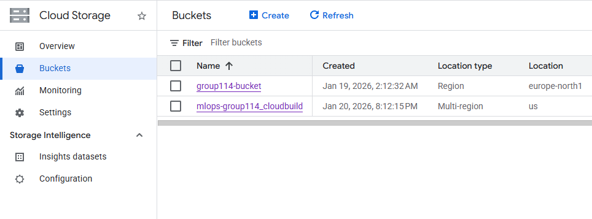
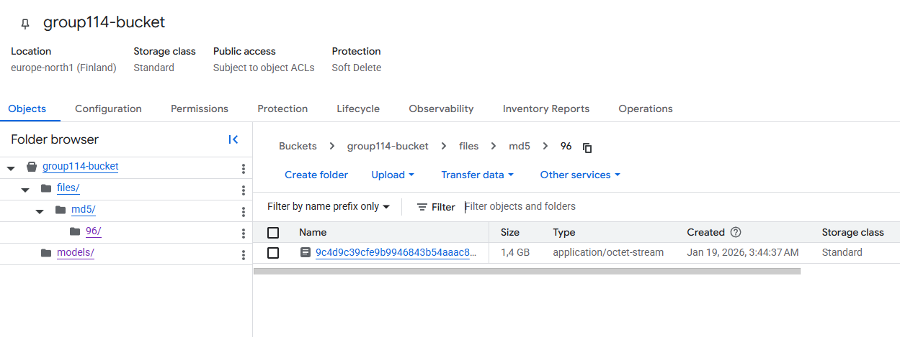
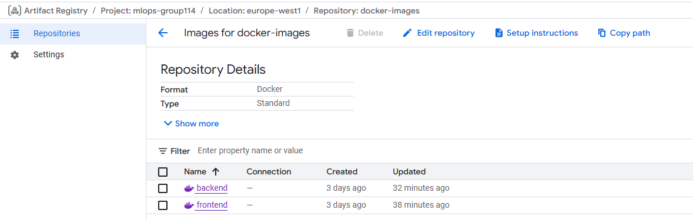
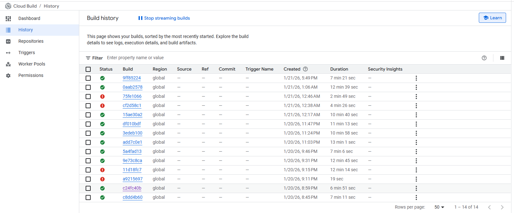

# Exam template for 02476 Machine Learning Operations

This is the report template for the exam. Please only remove the text formatted as with three dashes in front and behind
like:

```--- question 1 fill here ---```

Where you instead should add your answers. Any other changes may have unwanted consequences when your report is
auto-generated at the end of the course. For questions where you are asked to include images, start by adding the image
to the `figures` subfolder (please only use `.png`, `.jpg` or `.jpeg`) and then add the following code in your answer:

``

In addition to this markdown file, we also provide the `report.py` script that provides two utility functions:

Running:

```bash
python report.py html
```

Will generate a `.html` page of your report. After the deadline for answering this template, we will auto-scrape
everything in this `reports` folder and then use this utility to generate a `.html` page that will be your serve
as your final hand-in.

Running

```bash
python report.py check
```

Will check your answers in this template against the constraints listed for each question e.g. is your answer too
short, too long, or have you included an image when asked. For both functions to work you mustn't rename anything.
The script has two dependencies that can be installed with

```bash
pip install typer markdown
```

or

```bash
uv add typer markdown
```

## Overall project checklist

The checklist is *exhaustive* which means that it includes everything that you could do on the project included in the
curriculum in this course. Therefore, we do not expect at all that you have checked all boxes at the end of the project.
The parenthesis at the end indicates what module the bullet point is related to. Please be honest in your answers, we
will check the repositories and the code to verify your answers.

### Week 1

* [X] Create a git repository (M5)
* [X] Make sure that all team members have write access to the GitHub repository (M5)
* [X] Create a dedicated environment for you project to keep track of your packages (M2)
* [X] Create the initial file structure using cookiecutter with an appropriate template (M6)
* [X] Fill out the `data.py` file such that it downloads whatever data you need and preprocesses it (if necessary) (M6)
* [X] Add a model to `model.py` and a training procedure to `train.py` and get that running (M6)
* [X] Remember to either fill out the `requirements.txt`/`requirements_dev.txt` files or keeping your
    `pyproject.toml`/`uv.lock` up-to-date with whatever dependencies that you are using (M2+M6)
* [ ] Remember to comply with good coding practices (`pep8`) while doing the project (M7)
* [ ] Do a bit of code typing and remember to document essential parts of your code (M7)
* [X] Setup version control for your data or part of your data (M8)
* [ ] Add command line interfaces and project commands to your code where it makes sense (M9)
* [X] Construct one or multiple docker files for your code (M10)
* [X] Build the docker files locally and make sure they work as intended (M10)
* [X] Write one or multiple configurations files for your experiments (M11)
* [X] Used Hydra to load the configurations and manage your hyperparameters (M11)
* [ ] Use profiling to optimize your code (M12)
* [X] Use logging to log important events in your code (M14)
* [X] Use Weights & Biases to log training progress and other important metrics/artifacts in your code (M14)
* [X] Consider running a hyperparameter optimization sweep (M14)
* [ ] Use PyTorch-lightning (if applicable) to reduce the amount of boilerplate in your code (M15)

### Week 2

* [X] Write unit tests related to the data part of your code (M16)
* [X] Write unit tests related to model construction and or model training (M16)
* [ ] Calculate the code coverage (M16)
* [X] Get some continuous integration running on the GitHub repository (M17)
* [X] Add caching and multi-os/python/pytorch testing to your continuous integration (M17)
* [X] Add a linting step to your continuous integration (M17)
* [X] Add pre-commit hooks to your version control setup (M18)
* [ ] Add a continues workflow that triggers when data changes (M19)
* [ ] Add a continues workflow that triggers when changes to the model registry is made (M19)
* [X] Create a data storage in GCP Bucket for your data and link this with your data version control setup (M21)
* [X] Create a trigger workflow for automatically building your docker images (M21)
* [ ] Get your model training in GCP using either the Engine or Vertex AI (M21)
* [X] Create a FastAPI application that can do inference using your model (M22)
* [X] Deploy your model in GCP using either Functions or Run as the backend (M23)
* [X] Write API tests for your application and setup continues integration for these (M24)
* [X] Load test your application (M24)
* [X] Create a more specialized ML-deployment API using either ONNX or BentoML, or both (M25)
* [X] Create a frontend for your API (M26)

### Week 3

* [ ] Check how robust your model is towards data drifting (M27)
* [ ] Setup collection of input-output data from your deployed application (M27)
* [ ] Deploy to the cloud a drift detection API (M27)
* [ ] Instrument your API with a couple of system metrics (M28)
* [ ] Setup cloud monitoring of your instrumented application (M28)
* [ ] Create one or more alert systems in GCP to alert you if your app is not behaving correctly (M28)
* [ ] If applicable, optimize the performance of your data loading using distributed data loading (M29)
* [ ] If applicable, optimize the performance of your training pipeline by using distributed training (M30)
* [X] Play around with quantization, compilation and pruning for you trained models to increase inference speed (M31)

### Extra

* [ ] Write some documentation for your application (M32)
* [ ] Publish the documentation to GitHub Pages (M32)
* [X] Revisit your initial project description. Did the project turn out as you wanted?
* [ ] Create an architectural diagram over your MLOps pipeline
* [X] Make sure all group members have an understanding about all parts of the project
* [X] Uploaded all your code to GitHub

## Group information

### Question 1
> **Enter the group number you signed up on <learn.inside.dtu.dk>**
>
> Answer:

114

### Question 2
> **Enter the study number for each member in the group**
>
> Example:
>
> *sXXXXXX, sXXXXXX, sXXXXXX*
>
> Answer:

s253733, s253814, s252802, s253695

### Question 3
> **Did you end up using any open-source frameworks/packages not covered in the course during your project? If so**
> **which did you use and how did they help you complete the project?**
>
> Recommended answer length: 0-200 words.
>
> Example:
> *We used the third-party framework ... in our project. We used functionality ... and functionality ... from the*
> *package to do ... and ... in our project*.
>
> Answer:

............  For code quality, we adopted Ruff which replaced multiple tools (like Flake8, Isort and Black) due to its superior speed. We also used Uv for dependency manangement which significantly reduced our environment setup time compared to Pip or Conda.

## Coding environment

> In the following section we are interested in learning more about you local development environment. This includes
> how you managed dependencies, the structure of your code and how you managed code quality.

### Question 4

> **Explain how you managed dependencies in your project? Explain the process a new team member would have to go**
> **through to get an exact copy of your environment.**
>
> Recommended answer length: 100-200 words
>
> Example:
> *We used ... for managing our dependencies. The list of dependencies was auto-generated using ... . To get a*
> *complete copy of our development environment, one would have to run the following commands*
>
> Answer:

We used Uv to manage our dependencies because it's the latest industry trend. We defined our project requirements in a PyProject.toml file. To obtain a complete copy of our development environment, someone who has Uv installed must run the command "uv sync."
### Question 5

> **We expect that you initialized your project using the cookiecutter template. Explain the overall structure of your**
> **code. What did you fill out? Did you deviate from the template in some way?**
>
> Recommended answer length: 100-200 words
>
> Example:
> *From the cookiecutter template we have filled out the ... , ... and ... folder. We have removed the ... folder*
> *because we did not use any ... in our project. We have added an ... folder that contains ... for running our*
> *experiments.*
>
> Answer:

We initialized our project using the course-specific Cookiecutter template. We worked primarily within the "src" directory for our source code and the "configs" directory to manage hyperparameters with Hydra. We used the provided Dockerfiles folder for containerization and PyProject.toml for dependency management.

### Question 6

> **Did you implement any rules for code quality and format? What about typing and documentation? Additionally,**
> **explain with your own words why these concepts matters in larger projects.**
>
> Recommended answer length: 100-200 words.
>
> Example:
> *We used ... for linting and ... for formatting. We also used ... for typing and ... for documentation. These*
> *concepts are important in larger projects because ... . For example, typing ...*
>
> Answer:

We implemented code quality and formatting rules using Ruff as our linter and formatter. We automated this process using GitHub Actions to ensure that all code pushed to the repository aligns to PEP 8 standards. 

## Version control

> In the following section we are interested in how version control was used in your project during development to
> corporate and increase the quality of your code.

### Question 7

> **How many tests did you implement and what are they testing in your code?**
>
> Recommended answer length: 50-100 words.
>
> Example:
> *In total we have implemented X tests. Primarily we are testing ... and ... as these the most critical parts of our*
> *application but also ... .*
>
> Answer:

In total, we implemented four tests. Our primary focus was unit testing our critical components. For example, test_data.py verifies that our data loaders return the correct types and shapes of data. Meanwhile, test_model.py confirms that our model architecture processes inputs and produces outputs with the expected dimensions. We also implemented integration tests (test_integration.py) to ensure that the entire training pipeline runs without crashing from start to finish. 

### Question 8

> **What is the total code coverage (in percentage) of your code? If your code had a code coverage of 100% (or close**
> **to), would you still trust it to be error free? Explain you reasoning.**
>
> Recommended answer length: 100-200 words.
>
> Example:
> *The total code coverage of code is X%, which includes all our source code. We are far from 100% coverage of our **
> *code and even if we were then...*
>
> Answer:

Our project has a total code coverage of 53%. However, this number is heavily skewed by auxiliary scripts. Our critical components, such as model.py, data.py, and train.py, have excellent coverage, with scores of 100%, 93%, and 91%, respectively. Utility files (e.g., tasks.py) and visualization scripts lowered the overall average. Even if we achieved 100% coverage, we could not trust the code to be error-free. Code coverage only measures which lines were executed during testing, not whether the logic is correct.

### Question 9

> **Did you workflow include using branches and pull requests? If yes, explain how. If not, explain how branches and**
> **pull request can help improve version control.**
>
> Recommended answer length: 100-200 words.
>
> Example:
> *We made use of both branches and PRs in our project. In our group, each member had an branch that they worked on in*
> *addition to the main branch. To merge code we ...*
>
> Answer:

Yes, we used branches and pull requests throughout our project workflow to ensure collabration safety. Instead of pushing directly to the main branch, we adopted a feature branch workflow For every new task such as implementing pre-commit hooks we created a dedicated brach. This allow us to test features without risking stability of code. Once the feature was ready, we opened a Pull Reguest and we used this stage automatically run unit tests and linters. For instance, we often encountered linting errors during the PR process, which prevented broken code from merging. We only merged the branch into main after CI checks passed. This workflow signigicantly reduced merge confilicts and kept our main branc clean.

### Question 10

> **Did you use DVC for managing data in your project? If yes, then how did it improve your project to have version**
> **control of your data. If no, explain a case where it would be beneficial to have version control of your data.**
>
> Recommended answer length: 100-200 words.
>
> Example:
> *We did make use of DVC in the following way: ... . In the end it helped us in ... for controlling ... part of our*
> *pipeline*
>
> Answer:

We used DVC to manage our data, versioning the compressed dataset artifact, data.zip. Instead of pushing large files to GitHub, we stored the actual data in a Google Cloud Storage bucket (gs://group114-bucket) and only tracked the lightweight data.zip.dvc file in our Git repository. This setup streamlined our workflow by maintaining a clean, lightweight version control history. Any team member (or new environment) could retrieve the exact version of the dataset used for training by running "dvc pull." 

### Question 11

> **Discuss you continuous integration setup. What kind of continuous integration are you running (unittesting,**
> **linting, etc.)? Do you test multiple operating systems, Python  version etc. Do you make use of caching? Feel free**
> **to insert a link to one of your GitHub actions workflow.**
>
> Recommended answer length: 200-300 words.
>
> Example:
> *We have organized our continuous integration into 3 separate files: one for doing ..., one for running ... testing*
> *and one for running ... . In particular for our ..., we used ... .An example of a triggered workflow can be seen*
> *here: <weblink>*
>
> Answer:

We have organized our continuous integration process into a series of GitHub Actions workflows, each with a specific responsibility:

Quality Assurance: We use linting.yaml and codecheck.yaml with Ruff to enforce coding style and formatting standards. We also use Dependabot (dependabot.yaml) to automatically detect and suggest updates for our dependencies.

Testing: The tests.yaml workflow runs our Pytest suite to verify the unit and integration tests. It is triggered by every pull request and push to the main branch. It uses a build matrix to run these tests on Ubuntu, Windows, and macOS, ensuring cross-platform compatibility.

CML and MLOps Automation:
We implemented an event-driven CML_MODEL.YAML workflow that is triggered by a repository_dispatch signal from our model registry. This integration uses CML to automatically generate and post a Markdown report (model_report.md) as a comment on the repository whenever a new model version is registered. This ensures automated visibility for model updates.

Deployment: We use Google Cloud Build, as defined in backendbuild.yaml, for containerization. This pipeline builds our Docker image (backend:latest) and pushes it to the Artifact Registry using the gcr.io/cloud-builders/docker builder.

## Running code and tracking experiments

> In the following section we are interested in learning more about the experimental setup for running your code and
> especially the reproducibility of your experiments.

### Question 12

> **How did you configure experiments? Did you make use of config files? Explain with coding examples of how you would**
> **run a experiment.**
>
> Recommended answer length: 50-100 words.
>
> Example:
> *We used a simple argparser, that worked in the following way: Python  my_script.py --lr 1e-3 --batch_size 25*
>
> Answer:

We used Hydra to handle our training hyperparameters. Inside configs/, we created run.yaml where a seed can be specified, and where the default configuration for the trainer is selected. The trainer configuration is found inside configs/trainer/trainResNet50.yaml, which contains the training hyperparameters such as learning rate or number of epochs. You can run an experiment overriding parameters using: uv run invoke train --overrides= "trainer.train.total_epochs=50 trainer.init.optimizer.lr=0.001".

### Question 13

> **Reproducibility of experiments are important. Related to the last question, how did you secure that no information**
> **is lost when running experiments and that your experiments are reproducible?**
>
> Recommended answer length: 100-200 words.
>
> Example:
> *We made use of config files. Whenever an experiment is run the following happens: ... . To reproduce an experiment*
> *one would have to do ...*
>
> Answer:

We ensured reproducibility by strictly decoupling the configuration from the code using Hydra, and including a seed to ensure consistent results. One can set the seed_run parameter in configs/run.yaml. We use Weights & Biases (WandB) to automatically log the hyperparameters and resulting metrics used whenever an experiment is run. Whenever an experiment is started, the program's entry point is at src/mlopsproject/run.py, where we load our experiment configuration using Hydra and instantiate the necessary components to start the training process, taking advantage of a dependency injection pattern, which makes it very easy to swap components, such as different datasets, models, trainers, or loggers if needed.

### Question 14

> **Upload 1 to 3 screenshots that show the experiments that you have done in W&B (or another experiment tracking**
> **service of your choice). This may include loss graphs, logged images, hyperparameter sweeps etc. You can take**
> **inspiration from [this figure](figures/wandb.png). Explain what metrics you are tracking and why they are**
> **important.**
>
> Recommended answer length: 200-300 words + 1 to 3 screenshots.
>
> Example:
> *As seen in the first image when have tracked ... and ... which both inform us about ... in our experiments.*
> *As seen in the second image we are also tracking ... and ...*
>
> Answer:

--- question 14 fill here ---

### Question 15

> **Docker is an important tool for creating containerized applications. Explain how you used docker in your**
> **experiments/project? Include how you would run your docker images and include a link to one of your docker files.**
>
> Recommended answer length: 100-200 words.
>
> Example:
> *For our project we developed several images: one for training, inference and deployment. For example to run the*
> *training docker image: `docker run trainer:latest lr=1e-3 batch_size=64`. Link to docker file: <weblink>*
>
> Answer:

Docker is an amazing tool that we used to containerize important parts of our project, ensuring consistency across different environments, and simplifying deployments in the cloud. In our case, we have 4 main Docker images: train, frontend, backend (BentoML), and api (FastAPI). Each container is designed to accomplish a specific task, such as initializing our streamlit frontend service, starting a training job, or initializing our backend API, all with their corresponding dependencies, such as python packages or required files to run. To simplify the building and running process of the frontend and backend images, which typically require long commands with multiple flags, we created different tasks using invoke to simplyfy this. For example, to build the backend image, one would run "uv run invoke build-backend-docker" and to run it "uv run invoke run-frontend-docker", where you could specify different parameters such as the port. You can find our backend docker file here: https://github.com/GQO5/MLOpsProject114/blob/main/dockerfiles/backend.dockerfile.

### Question 16

> **When running into bugs while trying to run your experiments, how did you perform debugging? Additionally, did you**
> **try to profile your code or do you think it is already perfect?**
>
> Recommended answer length: 100-200 words.
>
> Example:
> *Debugging method was dependent on group member. Some just used ... and others used ... . We did a single profiling*
> *run of our main code at some point that showed ...*
>
> Answer:

We debugged our experiments using a hybrid approach. Using the VS Code debugger, we stepped through the logic and inspected the Docker logs for environmental issues. We also frequently consulted AI tools and technical videos to quickly interpret complex error stacks. Regarding profiling, we do not consider our code to be perfect. Rather than running deep profiling scripts, we monitored the system metrics in Weights & Biases.

## Working in the cloud

> In the following section we would like to know more about your experience when developing in the cloud.

### Question 17

> **List all the GCP services that you made use of in your project and shortly explain what each service does?**
>
> Recommended answer length: 50-200 words.
>
> Example:
> *We used the following two services: Engine and Bucket. Engine is used for... and Bucket is used for...*
>
> Answer:

For our project, we utilized several GCP services:
1. Compute Engine: We used Compute Engine to create virtual machines (VMs) for training our machine learning models. This service provided us with scalable computing resources, allowing us to choose VM types that matched our computational needs.
2. Cloud Storage (GCP Bucket): We used Cloud Storage to store our dataset.
3. Artifact Registry: We used Artifact Registry to store and manage our Docker images. This service allowed us to easily deploy our containerized applications.
4. Cloud Build: We used Cloud Build to automate the building and deployment of our Docker images.
5. Cloud run: We used Cloud run service to deploy our Frontend and Backend APIs in a serverless environment.
6. Vertex AI: [...].
7. Monitoring: [...]

### Question 18

> **The backbone of GCP is the Compute engine. Explained how you made use of this service and what type of VMs**
> **you used?**
>
> Recommended answer length: 100-200 words.
>
> Example:
> *We used the compute engine to run our ... . We used instances with the following hardware: ... and we started the*
> *using a custom container: ...*
>
> Answer:

--- question 18 fill here ---

### Question 19

> **Insert 1-2 images of your GCP bucket, such that we can see what data you have stored in it.**
> **You can take inspiration from [this figure](figures/bucket.png).**
>
> Answer:
> 




### Question 20

> **Upload 1-2 images of your GCP artifact registry, such that we can see the different docker images that you have**
> **stored. You can take inspiration from [this figure](figures/registry.png).**
>
> Answer:



### Question 21

> **Upload 1-2 images of your GCP cloud build history, so we can see the history of the images that have been build in**
> **your project. You can take inspiration from [this figure](figures/build.png).**
>
> Answer:



### Question 22

> **Did you manage to train your model in the cloud using either the Engine or Vertex AI? If yes, explain how you did**
> **it. If not, describe why.**
>
> Recommended answer length: 100-200 words.
>
> Example:
> *We managed to train our model in the cloud using the Engine. We did this by ... . The reason we choose the Engine*
> *was because ...*
>
> Answer:

--- question 22 fill here ---

## Deployment

### Question 23

> **Did you manage to write an API for your model? If yes, explain how you did it and if you did anything special. If**
> **not, explain how you would do it.**
>
> Recommended answer length: 100-200 words.
>
> Example:
> *We did manage to write an API for our model. We used FastAPI to do this. We did this by ... . We also added ...*
> *to the API to make it more ...*
>
> Answer:

We did write APIs for our model using both FastAPI, as well as a more specialized version using BentoML. Both do the exact same thing, on startup they load the model, and serve a /predict endpoint that takes an image and returns the prediction from our model. In order to output the correct predictions, an extra function had to be added called unscale(), which takes the raw, scaled outputs from the model and converts them back to the original scaled making used of the mean and std values used during preprocessing. In this case, both APIs have been containerized and deployed to GCP Cloud Run, but our frontend only interacts with the one specified in the Environment Variable called "BACKEND", which takes the path to the [backend url](https://backend-582302018737.europe-west1.run.app).

### Question 24

> **Did you manage to deploy your API, either in locally or cloud? If not, describe why. If yes, describe how and**
> **preferably how you invoke your deployed service?**
>
> Recommended answer length: 100-200 words.
>
> Example:
> *For deployment we wrapped our model into application using ... . We first tried locally serving the model, which*
> *worked. Afterwards we deployed it in the cloud, using ... . To invoke the service an user would call*
> *`curl -X POST -F "file=@file.json"<weburl>`*
>
> Answer:

Firstly, we designed our APIs and frontend and made sure that they were able to communicate locally, using localhost addresses. Once we confirmed that it worked locally, we then built the docker images for each part of the application and again, tested that they were able to interact, sending requests and visualizing the results in the frontend. Once that was confirmed, we then pushed the images to GCP Artifact Registry, and deployed them to Cloud run manually for the first time. This was the last check to confirm that everything worked as intended. Finally, a CD pipeline was created. The idea was to create a GCP trigger that automatically build, pushed and deployed the frontend and backend when new code was pushed to main. However, not every push to main contains changes to these, so a github action was created which detects individual changes to either the front, back, or both. Once a change is detected, a job is executed, which does the build, push and deploy steps automatically. This allows deploying only when necessary. To invoke the service, a user would simply navigate to the frontend url (https://frontend-582302018737.europe-west1.run.app/) and upload an image.

### Question 25

> **Did you perform any unit testing and load testing of your API? If yes, explain how you did it and what results for**
> **the load testing did you get. If not, explain how you would do it.**
>
> Recommended answer length: 100-200 words.
>
> Example:
> *For unit testing we used ... and for load testing we used ... . The results of the load testing showed that ...*
> *before the service crashed.*
>
> Answer:

Yes, we performed both unit testing and load testing of our BentoML API. For unit testing, we used Pytest to create a simple test that generates a dummy image, posts it to the /predict endpoint, and checks the response status code and that the correct keys are present in the response, as well as their value types. For load testing, we used Locust to simulate users accessing our front end "/" endpoint, as well as posting images to the "/predict" endpoint from the backend. This process was simplified by creating a task using invoke, load_test_backend and load_test_frontend, where you can specify different parameters to control the load test. The results showed that for a test of 200 users with a spawn rate of 30 users/s for 1 minute, the backend was able to handle the load with an average response time of 1500ms, 68.98 req/s, and a failure rate of 11%, mostly caused by "POST /predict: HTTPError('503 Server Error: Service Unavailable for url: /predict')". Most probably, those failures were due to the cold start of a second instance that had to be created due to the high load.

### Question 26

> **Did you manage to implement monitoring of your deployed model? If yes, explain how it works. If not, explain how**
> **monitoring would help the longevity of your application.**
>
> Recommended answer length: 100-200 words.
>
> Example:
> *We did not manage to implement monitoring. We would like to have monitoring implemented such that over time we could*
> *measure ... and ... that would inform us about this ... behaviour of our application.*
>
> Answer:

Yes, we implemented a monitoring system to ensure the longevity and reliability of our deployed model. Our solution uses the FastAPI inference endpoint to log all incoming request images and generated predictions asynchronously to Google Cloud Storage. This creates a persistent historical record of production data. To monitor for degradation, we integrated Evidently AI. Evidently AI periodically retrieves live data and runs statistical tests to compare it with our training reference data. It automatically flags significant data drift. Additionally, we incorporated a robustness check into our CI/CD pipeline that injects synthetic noise into the validation data to measure mean squared error (MSE) degradation. This allows us to proactively assess how the model handles potential quality drops before they affect users.

## Overall discussion of project

> In the following section we would like you to think about the general structure of your project.

### Question 27

> **How many credits did you end up using during the project and what service was most expensive? In general what do**
> **you think about working in the cloud?**
>
> Recommended answer length: 100-200 words.
>
> Example:
> *Group member 1 used ..., Group member 2 used ..., in total ... credits was spend during development. The service*
> *costing the most was ... due to ... . Working in the cloud was ...*
>
> Answer:

--- question 27 fill here ---

### Question 28

> **Did you implement anything extra in your project that is not covered by other questions? Maybe you implemented**
> **a frontend for your API, use extra version control features, a drift detection service, a kubernetes cluster etc.**
> **If yes, explain what you did and why.**
>
> Recommended answer length: 0-200 words.
>
> Example:
> *We implemented a frontend for our API. We did this because we wanted to show the user ... . The frontend was*
> *implemented using ...*
>
> Answer:

Our project was focused towards deploying an AI application that a user could interact with. Of course, no everyone is comfortable using APIs directly, so instead we created a user-friendly frontend using Streamlit, and customized it with html generated with the help of [Google Stitch](https://stitch.withgoogle.com/), which created a minimalistic but modern design. This html was then integrated into our Streamlit app with the help of the html() function and a frontend_utils.py file. The frontend simply takes a user image input, sends it to the backend API for inference and returns the prediction which is the displayed to the user. Feel free to [try it out](https://frontend-582302018737.europe-west1.run.app/) (The backend might take a minute to start after the first input is given).

### Question 29

> **Include a figure that describes the overall architecture of your system and what services that you make use of.**
> **You can take inspiration from [this figure](figures/overview.png). Additionally, in your own words, explain the**
> **overall steps in figure.**
>
> Recommended answer length: 200-400 words
>
> Example:
>
> *The starting point of the diagram is our local setup, where we integrated ... and ... and ... into our code.*
> *Whenever we commit code and push to GitHub, it auto triggers ... and ... . From there the diagram shows ...*
>
> Answer:

--- question 29 fill here ---

### Question 30

> **Discuss the overall struggles of the project. Where did you spend most time and what did you do to overcome these**
> **challenges?**
>
> Recommended answer length: 200-400 words.
>
> Example:
> *The biggest challenges in the project was using ... tool to do ... . The reason for this was ...*
>
> Answer:

--- question 30 fill here ---

### Question 31

> **State the individual contributions of each team member. This is required information from DTU, because we need to**
> **make sure all members contributed actively to the project. Additionally, state if/how you have used generative AI**
> **tools in your project.**
>
> Recommended answer length: 50-300 words.
>
> Example:
> *Student sXXXXXX was in charge of developing of setting up the initial cookie cutter project and developing of the*
> *docker containers for training our applications.*
> *Student sXXXXXX was in charge of training our models in the cloud and deploying them afterwards.*
> *All members contributed to code by...*
> *We have used ChatGPT to help debug our code. Additionally, we used GitHub Copilot to help write some of our code.*
> Answer:

--- question 31 fill here ---


In preparing this work, we used large language models (LLMs), such as ChatGPT, to help with
aspects of writing, coding, and creating a figures. Specifically, we used generative AI tools to paraphrase
and refine text passages to improve clarity, readability, and adherence to academic style.  Additionally, LLMs helped verify code
correctness and suggest modifications to improve computational efficiency and performance. 
